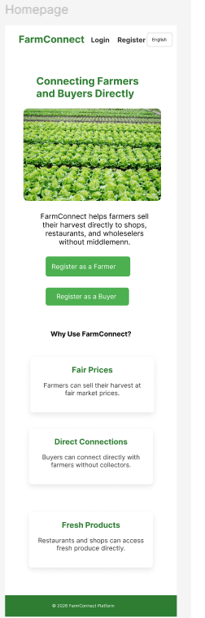
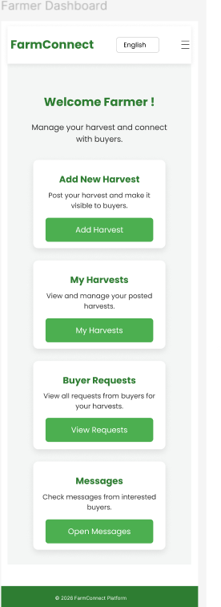
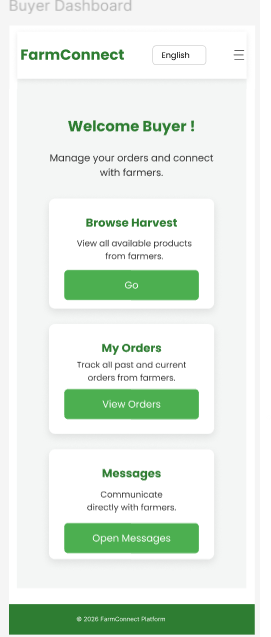
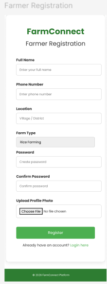

# Bachelor's Thesis

# 🌱 FarmConnect

A digital marketplace prototype designed to enable direct trade between farmers and shops in Sri Lanka.

## 📖 About the Project

FarmConnect is a UI/UX prototype designed to help farmers sell their harvest directly to shops while helping buyers discover available agricultural products.

The project was developed as part of my Bachelor's thesis at Turku University of Applied Sciences.

## 🎨 Design & Prototyping

- Figma
- UI/UX Design
- High-Fidelity Prototyping
- User-Centered Design
- Accessibility Considerations

## ✨ Key Features

- Farmer registration and dashboard
- Buyer registration and dashboard
- Add and manage harvests
- Browse available harvests
- Buyer requests
- Messaging
- Orders
- Transportation pickup
- Sinhala, English, and Tamil language support

## 🎨 Figma Design

[🔗 View FarmConnect in Figma](https://www.figma.com/design/iDw9PYEVSDJyJ0k8RhRJfB/FarmConnect-Hifi?node-id=0-1&t=8jhkHoNUmwU1HFKK-1)

## Thesis

[🔗 View my Thesis](https://urn.fi/URN:NBN:fi:amk-2026060522656)

## 📸 Screenshots

### Home

### Farmer Dashboard

### Buyer Dashboard

### Registration Form

